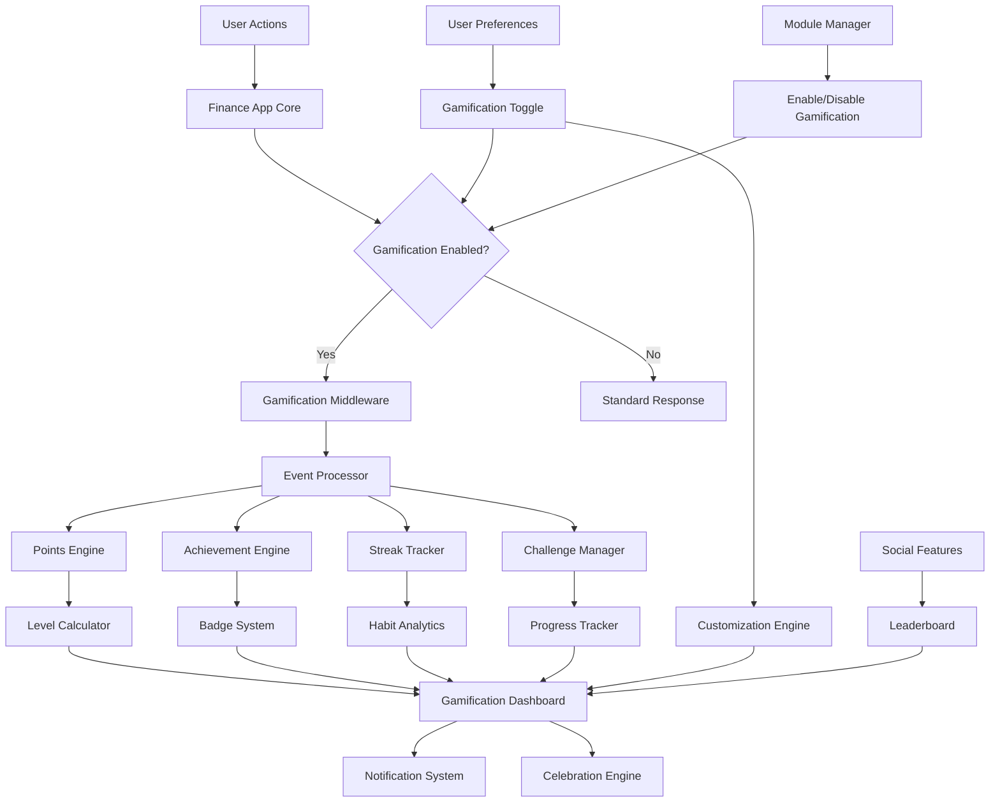

# Design Document

## Overview

The Gamified Finance Habits system transforms routine financial management into an engaging, habit-building experience through carefully designed game mechanics. Based on behavioral psychology research, the system uses immediate rewards, progressive challenges, and social elements to foster lasting financial habits while maintaining user autonomy and intrinsic motivation.

The design emphasizes sustainable habit formation over short-term engagement, incorporating principles from behavioral economics and neuroscience research on reward pathways. Key insights from industry research show that [gamified apps demonstrate 47% higher engagement](https://ripenapps.com/blog/https-ripenapps-com-blog-the-role-of-gamification-in-fintech-apps/) and can increase user retention significantly when properly implemented.

## Architecture

The gamification system follows a completely modular architecture that can be enabled or disabled at the user level. When disabled, the finance app functions normally without any gamification elements. The system integrates seamlessly with existing finance app components through an optional middleware layer:



### Core Components

1. **Gamification Middleware**: Optional layer that intercepts financial actions when gamification is enabled
2. **Module Manager**: Controls enabling/disabling of the entire gamification system
3. **Event Processor**: Captures and categorizes user financial actions (only when enabled)
4. **Points Engine**: Calculates and awards experience points based on actions
5. **Achievement Engine**: Manages milestone tracking and badge unlocking
6. **Streak Tracker**: Monitors consecutive habit performance
7. **Challenge Manager**: Creates and manages time-limited goals
8. **Gamification Dashboard**: Central UI for displaying progress and achievements (hidden when disabled)

### Modular Design Principles

- **Zero Impact When Disabled**: When gamification is disabled, there is no performance impact on the core finance app
- **Progressive Enhancement**: Gamification enhances the existing experience without replacing core functionality
- **Clean Separation**: All gamification logic is contained within the gamification module
- **Graceful Degradation**: UI components adapt seamlessly whether gamification is enabled or disabled

## Components and Interfaces

### Gamification Module Manager

The module manager controls the entire gamification system state:

```typescript
interface GamificationModuleManager {
  isEnabled(userId: string): Promise<boolean>
  enableGamification(userId: string): Promise<void>
  disableGamification(userId: string): Promise<void>
  getModuleStatus(userId: string): Promise<ModuleStatus>
  migrateUserData(userId: string, enabled: boolean): Promise<void>
}

interface ModuleStatus {
  enabled: boolean
  enabledAt?: Date
  disabledAt?: Date
  dataRetentionPolicy: DataRetentionPolicy
  features: {
    points: boolean
    achievements: boolean
    streaks: boolean
    challenges: boolean
    social: boolean
  }
}

enum DataRetentionPolicy {
  PRESERVE = 'preserve', // Keep data when disabled, restore when re-enabled
  ARCHIVE = 'archive',   // Archive data when disabled, can be restored
  DELETE = 'delete'      // Delete data when disabled (user choice)
}
```

### Gamification Engine

The core engine only processes events when gamification is enabled:

```typescript
interface GamificationEngine {
  isEnabledForUser(userId: string): Promise<boolean>
  processFinancialEvent(event: FinancialEvent): Promise<GamificationResult | null>
  calculateExperiencePoints(action: ActionType, context: ActionContext): number
  updateUserProgress(userId: string, result: GamificationResult): Promise<void>
  checkAchievements(userId: string, action: ActionType): Achievement[]
  updateStreaks(userId: string, action: ActionType): StreakUpdate
}

interface GamificationResult {
  pointsAwarded: number
  achievementsUnlocked: Achievement[]
  streaksUpdated: StreakUpdate[]
  celebrationTriggered: boolean
  levelUp?: LevelUpResult
}

// Returns null if gamification is disabled for the user
type ProcessResult = GamificationResult | null

interface FinancialEvent {
  userId: string
  actionType: ActionType
  timestamp: Date
  metadata: Record<string, any>
  category?: string
  amount?: number
}

enum ActionType {
  EXPENSE_ADDED = 'expense_added',
  INVOICE_CREATED = 'invoice_created',
  RECEIPT_UPLOADED = 'receipt_uploaded',
  BUDGET_REVIEWED = 'budget_reviewed',
  PAYMENT_RECORDED = 'payment_recorded',
  CATEGORY_ASSIGNED = 'category_assigned'
}
```

### Points System

Experience points are awarded based on action complexity and habit-building value:

```typescript
interface PointsCalculator {
  basePoints: Record<ActionType, number>
  bonusMultipliers: {
    streak: number
    accuracy: number
    completeness: number
    timeliness: number
  }
  
  calculatePoints(action: ActionType, context: ActionContext): number
}

// Point values based on habit-building importance
const BASE_POINTS = {
  EXPENSE_ADDED: 10,
  INVOICE_CREATED: 15,
  RECEIPT_UPLOADED: 3,
  BUDGET_REVIEWED: 20,
  PAYMENT_RECORDED: 12,
  CATEGORY_ASSIGNED: 5
}
```

### Achievement System

Achievements are designed to encourage exploration of all app features and sustained engagement:

```typescript
interface Achievement {
  id: string
  name: string
  description: string
  category: AchievementCategory
  difficulty: AchievementDifficulty
  requirements: AchievementRequirement[]
  reward: AchievementReward
  isHidden: boolean
}

enum AchievementCategory {
  EXPENSE_TRACKING = 'expense_tracking',
  INVOICE_MANAGEMENT = 'invoice_management',
  HABIT_FORMATION = 'habit_formation',
  FINANCIAL_HEALTH = 'financial_health',
  EXPLORATION = 'exploration'
}

enum AchievementDifficulty {
  BRONZE = 'bronze',
  SILVER = 'silver', 
  GOLD = 'gold',
  PLATINUM = 'platinum'
}
```

### Streak Management

Streaks are central to habit formation, using psychological principles of consistency and momentum:

```typescript
interface StreakTracker {
  trackStreak(userId: string, habitType: HabitType): StreakStatus
  calculateStreakBonus(streakLength: number): number
  handleStreakBreak(userId: string, habitType: HabitType): StreakRecovery
  getStreakInsights(userId: string): StreakAnalytics
}

interface StreakStatus {
  current: number
  longest: number
  lastActivity: Date
  isActive: boolean
  riskLevel: StreakRiskLevel
}

enum HabitType {
  DAILY_EXPENSE_TRACKING = 'daily_expense_tracking',
  WEEKLY_BUDGET_REVIEW = 'weekly_budget_review',
  INVOICE_FOLLOW_UP = 'invoice_follow_up',
  RECEIPT_DOCUMENTATION = 'receipt_documentation'
}
```

### Challenge System

Time-limited challenges provide variety and focused improvement opportunities:

```typescript
interface Challenge {
  id: string
  name: string
  description: string
  type: ChallengeType
  duration: ChallengeDuration
  requirements: ChallengeRequirement[]
  rewards: ChallengeReward[]
  startDate: Date
  endDate: Date
  participants?: number
}

enum ChallengeType {
  PERSONAL = 'personal',
  COMMUNITY = 'community',
  SEASONAL = 'seasonal'
}

interface ChallengeProgress {
  challengeId: string
  userId: string
  progress: number
  completed: boolean
  milestones: ChallengeMilestone[]
}
```

## Data Models

### User Gamification Profile

```typescript
interface UserGamificationProfile {
  userId: string
  moduleEnabled: boolean
  level: number
  totalExperiencePoints: number
  currentLevelProgress: number
  achievements: UserAchievement[]
  activeStreaks: UserStreak[]
  activeChallenges: UserChallenge[]
  financialHealthScore: number
  preferences: GamificationPreferences
  statistics: UserStatistics
  enabledAt?: Date
  disabledAt?: Date
  createdAt: Date
  updatedAt: Date
}

// Profile is null or minimal when gamification is disabled
interface MinimalProfile {
  userId: string
  moduleEnabled: false
  preferences: {
    enabled: false
    dataRetentionPolicy: DataRetentionPolicy
  }
}

interface UserAchievement {
  achievementId: string
  unlockedAt: Date
  progress: number
  isCompleted: boolean
}

interface UserStreak {
  habitType: HabitType
  currentLength: number
  longestLength: number
  lastActivityDate: Date
  isActive: boolean
}
```

### Modular UI Components

The UI adapts based on gamification status:

```typescript
interface GamificationUIProvider {
  shouldShowGamificationElements(userId: string): Promise<boolean>
  getGamificationWidgets(userId: string): Promise<UIWidget[]>
  getProgressIndicators(userId: string): Promise<ProgressIndicator[]>
  getCelebrationComponents(): CelebrationComponent[]
}

// UI Components that conditionally render
interface ConditionalGamificationUI {
  ProgressBar?: React.Component      // Shows XP/Level progress
  AchievementBadges?: React.Component // Shows recent achievements
  StreakIndicators?: React.Component  // Shows active streaks
  ChallengeCards?: React.Component    // Shows active challenges
  HealthScoreWidget?: React.Component // Shows financial health score
}

// Standard finance UI remains unchanged when gamification is disabled
interface StandardFinanceUI {
  ExpenseList: React.Component       // Always present
  InvoiceManager: React.Component    // Always present
  BudgetTracker: React.Component     // Always present
  Reports: React.Component           // Always present
}
```

### Organizational Configuration System

Organization administrators can customize gamification parameters to align with company financial policies:

```typescript
interface OrganizationGamificationConfig {
  organizationId: string
  enabled: boolean
  customPointValues: CustomPointValues
  achievementThresholds: AchievementThresholds
  enabledFeatures: OrganizationFeatures
  customChallenges: CustomChallenge[]
  teamSettings: TeamSettings
  analyticsSettings: AnalyticsSettings
  policyAlignment: PolicyAlignment
  createdBy: string
  updatedBy: string
  createdAt: Date
  updatedAt: Date
}

interface CustomPointValues {
  expenseTracking: number        // Default: 10, Admin can set 5-50
  invoiceCreation: number        // Default: 15, Admin can set 10-100
  budgetReview: number          // Default: 20, Admin can set 15-100
  receiptUpload: number         // Default: 3, Admin can set 1-10
  categoryAccuracy: number      // Default: 5, Admin can set 2-15
  timelyReminders: number       // Default: 8, Admin can set 5-25
  promptPaymentMarking: number  // Default: 12, Admin can set 8-30
}

interface AchievementThresholds {
  expenseMilestones: number[]   // Default: [10, 50, 100, 500], Admin customizable
  invoiceMilestones: number[]   // Default: [1, 10, 100], Admin customizable
  streakMilestones: number[]    // Default: [7, 30, 90, 365], Admin customizable
  budgetAdherenceThreshold: number // Default: 90%, Admin can set 70-100%
}

interface OrganizationFeatures {
  points: boolean
  achievements: boolean
  streaks: boolean
  challenges: boolean
  leaderboards: boolean
  teamChallenges: boolean
  socialSharing: boolean
  notifications: boolean
}

interface CustomChallenge {
  id: string
  name: string
  description: string
  type: 'expense_accuracy' | 'budget_adherence' | 'invoice_timeliness' | 'receipt_compliance'
  duration: number // days
  target: number
  reward: ChallengeReward
  isActive: boolean
  applicableRoles: string[]
}

interface TeamSettings {
  enableTeamLeaderboards: boolean
  teamChallengeFrequency: 'weekly' | 'monthly' | 'quarterly'
  crossTeamCompetition: boolean
  teamSizeForChallenges: number
  anonymousLeaderboards: boolean
}

interface PolicyAlignment {
  expenseCategories: string[]        // Required categories for full points
  receiptRequirements: ReceiptPolicy // When receipts are mandatory
  budgetEnforcement: BudgetPolicy    // How strict budget adherence should be
  invoiceTimelines: InvoicePolicy    // Expected invoice follow-up timelines
}

enum ReceiptPolicy {
  OPTIONAL = 'optional',
  REQUIRED_OVER_AMOUNT = 'required_over_amount',
  ALWAYS_REQUIRED = 'always_required'
}

interface BudgetPolicy {
  enforceStrictLimits: boolean
  warningThreshold: number // percentage
  penalizeOverspending: boolean
}

interface InvoicePolicy {
  reminderFrequency: number // days
  escalationThreshold: number // days
  requiredFollowUpActions: string[]
}
```

### Organization Admin Interface

```typescript
interface OrganizationGamificationAdmin {
  getOrganizationConfig(orgId: string): Promise<OrganizationGamificationConfig>
  updatePointValues(orgId: string, values: CustomPointValues): Promise<void>
  setAchievementThresholds(orgId: string, thresholds: AchievementThresholds): Promise<void>
  createCustomChallenge(orgId: string, challenge: CustomChallenge): Promise<void>
  getTeamAnalytics(orgId: string, timeRange: TimeRange): Promise<TeamAnalytics>
  enableFeatureForOrg(orgId: string, feature: string, enabled: boolean): Promise<void>
  getEngagementMetrics(orgId: string): Promise<EngagementMetrics>
}

interface TeamAnalytics {
  totalActiveUsers: number
  averageEngagementScore: number
  habitFormationProgress: HabitProgress[]
  topPerformingTeams: TeamPerformance[]
  challengeCompletionRates: ChallengeMetrics[]
  financialHealthTrends: HealthTrend[]
}

interface EngagementMetrics {
  dailyActiveUsers: number
  weeklyActiveUsers: number
  averageSessionDuration: number
  featureUsageStats: FeatureUsage[]
  habitConsistencyScores: ConsistencyMetric[]
}
```

### User Preference Hierarchy

The system respects a hierarchy of preferences: User Privacy > Organization Policy > System Defaults

```typescript
interface PreferenceResolver {
  resolveUserPreferences(userId: string, orgId: string): Promise<ResolvedPreferences>
  canUserOverride(setting: string, orgId: string): boolean
  getEffectiveSettings(userId: string): Promise<EffectiveGamificationSettings>
}

interface ResolvedPreferences {
  source: 'user' | 'organization' | 'system'
  pointValues: CustomPointValues
  enabledFeatures: OrganizationFeatures
  notificationSettings: NotificationPreferences
  privacySettings: PrivacySettings // Always user-controlled
}

// Privacy settings are always user-controlled, never overridden by org
interface PrivacySettings {
  shareWithTeam: boolean           // User choice only
  showOnLeaderboard: boolean       // User choice only
  allowDataAnalytics: boolean      // User choice only
  shareAchievements: boolean       // User choice only
}
```

```typescript
interface GamificationPreferences {
  enabled: boolean
  features: {
    points: boolean
    achievements: boolean
    streaks: boolean
    challenges: boolean
    social: boolean
    notifications: boolean
  }
  privacy: {
    shareAchievements: boolean
    showOnLeaderboard: boolean
    allowFriendRequests: boolean
  }
  notifications: {
    streakReminders: boolean
    achievementCelebrations: boolean
    challengeUpdates: boolean
    frequency: NotificationFrequency
  }
  dataRetention: DataRetentionPolicy
}

enum NotificationFrequency {
  IMMEDIATE = 'immediate',
  DAILY = 'daily',
  WEEKLY = 'weekly',
  DISABLED = 'disabled'
}
```

```typescript
interface UserGamificationProfile {
  userId: string
  level: number
  totalExperiencePoints: number
  currentLevelProgress: number
  achievements: UserAchievement[]
  activeStreaks: UserStreak[]
  activeChallenges: UserChallenge[]
  financialHealthScore: number
  preferences: GamificationPreferences
  statistics: UserStatistics
  createdAt: Date
  updatedAt: Date
}

interface UserAchievement {
  achievementId: string
  unlockedAt: Date
  progress: number
  isCompleted: boolean
}

interface UserStreak {
  habitType: HabitType
  currentLength: number
  longestLength: number
  lastActivityDate: Date
  isActive: boolean
}
```

### Financial Health Scoring

The Financial Health Score combines multiple metrics to provide a holistic view of financial management:

```typescript
interface FinancialHealthCalculator {
  calculateScore(userId: string): Promise<FinancialHealthScore>
  getScoreComponents(): HealthScoreComponent[]
  updateScore(userId: string, event: FinancialEvent): Promise<void>
}

interface FinancialHealthScore {
  overall: number // 0-100
  components: {
    expenseTracking: number
    budgetAdherence: number
    invoiceManagement: number
    habitConsistency: number
    financialGoals: number
  }
  trend: ScoreTrend
  recommendations: string[]
}

enum ScoreTrend {
  IMPROVING = 'improving',
  STABLE = 'stable',
  DECLINING = 'declining'
}
```

## Correctness Properties

*A property is a characteristic or behavior that should hold true across all valid executions of a system-essentially, a formal statement about what the system should do. Properties serve as the bridge between human-readable specifications and machine-verifiable correctness guarantees.*

Based on the prework analysis, here are the key correctness properties for the gamification system:

### Property 1: Experience Point Awards
*For any* financial action performed by a user, the system should award the appropriate base experience points plus any applicable bonuses (streak multipliers, accuracy bonuses, completeness bonuses)
**Validates: Requirements 1.1, 2.1, 2.3, 2.4, 3.1, 3.2, 3.3**

### Property 2: Level Progression
*For any* user with sufficient accumulated experience points, the system should level up the user and display appropriate celebration
**Validates: Requirements 1.2**

### Property 3: Milestone Achievement Unlocking
*For any* user reaching specific milestones (expense counts, invoice counts, streak lengths), the system should unlock the corresponding achievements and award badges
**Validates: Requirements 1.3, 2.5, 3.5, 4.5**

### Property 4: Data Persistence
*For any* user progress, points, achievements, or streaks, the data should be retrievable after storage and system restart
**Validates: Requirements 1.4**

### Property 5: Profile Completeness
*For any* user viewing their profile, the display should include current level, total XP, and recent achievements
**Validates: Requirements 1.5**

### Property 6: Streak Management
*For any* user performing daily activities (expense tracking, budget reviews, invoice follow-ups), the system should maintain accurate streak counters and apply appropriate multipliers
**Validates: Requirements 2.2, 3.4, 4.1, 4.2, 4.3**

### Property 7: Streak Recovery
*For any* user who breaks a streak, the system should provide encouraging messages and streak recovery challenges
**Validates: Requirements 4.4**

### Property 8: Achievement Category Completeness
*For any* achievement system query, the system should include achievements for all major categories: expense tracking, invoice management, budget adherence, habit formation, and exceptional behaviors
**Validates: Requirements 5.1, 5.2, 5.3, 5.4, 5.5**

### Property 9: Achievement Celebration
*For any* user unlocking an achievement, the system should display celebration animation and award the corresponding badge
**Validates: Requirements 5.6**

### Property 10: Achievement Difficulty Classification
*For any* achievement in the system, it should be categorized by difficulty level (Bronze, Silver, Gold, Platinum)
**Validates: Requirements 5.7**

### Property 11: Challenge Availability
*For any* time period, the system should offer weekly challenges focused on financial habits and monthly challenges with larger rewards
**Validates: Requirements 6.1, 6.2, 6.4**

### Property 12: Challenge Completion Rewards
*For any* user completing a challenge, the system should award bonus experience points and special badges
**Validates: Requirements 6.3**

### Property 13: Challenge User Control
*For any* user, the system should provide options to opt-in or opt-out of challenges and display progress with time remaining
**Validates: Requirements 6.5, 6.6**

### Property 14: Financial Health Score Calculation
*For any* user, the Financial Health Score should be calculated based on expense tracking consistency, budget adherence, and invoice management, displayed on a 0-100 scale
**Validates: Requirements 7.1, 7.3**

### Property 15: Real-time Score Updates
*For any* financial task completed by a user, the Financial Health Score should update in real-time
**Validates: Requirements 7.2**

### Property 16: Score Improvement Bonuses
*For any* significant improvement in Financial Health Score, the system should award bonus experience points
**Validates: Requirements 7.4**

### Property 17: Score Recommendations
*For any* Financial Health Score, the system should provide specific recommendations for improvement
**Validates: Requirements 7.5**

### Property 18: Dashboard Completeness
*For any* user accessing the progress dashboard, it should display current level, XP, progress to next level, recent achievements, active streaks, health score trends, and active challenges
**Validates: Requirements 8.1, 8.2, 8.3, 8.4, 8.5**

### Property 19: Milestone Celebrations
*For any* user completing significant milestones or leveling up, the system should display celebration animations and congratulatory messages
**Validates: Requirements 9.1, 9.5**

### Property 20: Streak Risk Notifications
*For any* user with at-risk streaks, the system should send gentle reminder notifications
**Validates: Requirements 9.2**

### Property 21: Return User Welcome
*For any* user returning after absence, the system should provide welcome back messages with recovery suggestions
**Validates: Requirements 9.3**

### Property 22: Daily Motivational Content
*For any* day, the system should provide motivational tips related to financial management
**Validates: Requirements 9.4**

### Property 23: Social Features Conditional Availability
*For any* user with social features enabled, the system should display leaderboards, allow achievement sharing, and offer group challenges
**Validates: Requirements 10.1, 10.2, 10.3**

### Property 24: Social Privacy Controls
*For any* social feature, it should be opt-in and privacy-respecting, with options to disable completely
**Validates: Requirements 10.4, 10.5**

### Property 25: Progressive Habit Difficulty
*For any* habit being tracked, the system should use progressive difficulty to gradually build habits and provide educational content
**Validates: Requirements 11.1, 11.2**

### Property 26: Habit Strength Tracking
*For any* habit, the system should track habit strength and provide feedback on consistency
**Validates: Requirements 11.3**

### Property 27: Adaptive Habit Support
*For any* user struggling with habit formation, the system should suggest easier starting points and celebrate milestones with special recognition
**Validates: Requirements 11.4, 11.5**

### Property 29: Modular System Control
*For any* user, the system should provide a master toggle to enable/disable all gamification features, and when disabled, the finance app should function normally without performance impact
**Validates: Requirements 13.1, 13.2**

### Property 30: Data Retention Control
*For any* user disabling gamification, the system should allow choosing data retention policy and properly handle data according to that policy
**Validates: Requirements 13.3, 13.4**

### Property 31: Seamless UI Adaptation
*For any* user interface state, the UI should adapt seamlessly whether gamification is enabled or disabled
**Validates: Requirements 13.6**

### Property 33: Organization Configuration Control
*For any* organization administrator, the system should provide controls to customize point values, achievement thresholds, enabled features, and custom challenges for their organization
**Validates: Requirements 14.1, 14.2, 14.3, 14.4, 14.5**

### Property 34: Organization Team Features
*For any* organization with team features enabled, the system should provide team leaderboards, team challenges, and organization-wide analytics
**Validates: Requirements 14.6, 14.8**

### Property 35: Preference Hierarchy Respect
*For any* user in an organization, the system should respect the hierarchy: user privacy choices > organization policies > system defaults
**Validates: Requirements 14.7**

### Property 36: Custom Challenge Creation
*For any* organization administrator, the system should allow creation of custom challenges aligned with company financial policies
**Validates: Requirements 14.5**

### Property 37: Comprehensive User Customization
*For any* user, the system should allow enabling/disabling specific game mechanics, setting personal goals, choosing notification frequency, selecting achievement categories, and choosing visual themes, while respecting organizational policies
**Validates: Requirements 12.1, 12.2, 12.3, 12.4, 12.5**

<function_calls>
<invoke name="prework">
<parameter name="featureName">gamified-finance-habits

## Error Handling

The gamification system must handle various error conditions gracefully while maintaining user engagement:

### Data Consistency Errors
- **Duplicate Point Awards**: Implement idempotency keys to prevent double-awarding points for the same action
- **Achievement State Corruption**: Use atomic transactions for achievement unlocking to prevent partial states
- **Streak Calculation Errors**: Implement streak validation and recovery mechanisms for timezone and date calculation issues

### User Experience Errors
- **Missing Celebrations**: Ensure celebration animations have fallback mechanisms if rendering fails
- **Notification Failures**: Implement retry logic for streak reminders and achievement notifications
- **Dashboard Loading Errors**: Provide graceful degradation when gamification data is temporarily unavailable

### Integration Errors
- **Financial Event Processing**: Handle malformed or missing financial events without breaking the gamification flow
- **External Service Failures**: Implement circuit breakers for social features and leaderboard services
- **Database Connectivity**: Provide offline-capable caching for critical gamification data

### Error Recovery Strategies
```typescript
interface ErrorRecoveryService {
  recalculateUserProgress(userId: string): Promise<void>
  validateStreakConsistency(userId: string): Promise<StreakValidationResult>
  repairAchievementState(userId: string): Promise<void>
  syncGamificationData(userId: string): Promise<void>
}
```

## Testing Strategy

The gamification system requires comprehensive testing to ensure reliable habit formation and user engagement:

### Unit Testing Approach
- **Points Calculation**: Test all point award scenarios including base points, bonuses, and multipliers
- **Achievement Logic**: Verify milestone detection and achievement unlocking for all categories
- **Streak Management**: Test streak calculation, bonus application, and break recovery
- **Score Calculation**: Validate Financial Health Score computation and trend analysis
- **Challenge Management**: Test challenge creation, progress tracking, and completion detection

### Property-Based Testing Configuration
Property-based tests will use **Hypothesis** (Python) or **fast-check** (TypeScript) with minimum 100 iterations per test. Each test will be tagged with the format: **Feature: gamified-finance-habits, Property {number}: {property_text}**

Key property test areas:
- **Invariant Properties**: Points never decrease, levels never go backwards, achievements once unlocked remain unlocked
- **Round-trip Properties**: User progress serialization/deserialization maintains consistency
- **Metamorphic Properties**: Adding more financial activities should never decrease overall progress
- **Error Condition Properties**: Invalid inputs should be handled gracefully without corrupting user state

### Integration Testing
- **Event Processing Pipeline**: Test end-to-end flow from financial actions to gamification updates
- **Dashboard Rendering**: Verify all gamification data displays correctly across different user states
- **Notification System**: Test streak reminders and achievement notifications across different user preferences
- **Social Features**: Test leaderboard updates and achievement sharing when enabled

### Performance Testing
- **Concurrent User Updates**: Test system behavior under high concurrent gamification updates
- **Large Dataset Handling**: Verify performance with users having extensive achievement and streak histories
- **Real-time Updates**: Test responsiveness of Financial Health Score and dashboard updates

### User Experience Testing
- **Celebration Timing**: Verify celebrations appear at appropriate moments without disrupting workflow
- **Habit Formation Effectiveness**: Test that gamification mechanics actually encourage consistent behavior
- **Customization Impact**: Verify that user preferences properly modify the gamification experience

The testing strategy emphasizes both correctness (through property-based testing) and user experience (through integration and UX testing) to ensure the gamification system effectively promotes financial habits while maintaining system reliability.

## Implementation Notes

### Behavioral Psychology Considerations
Based on research insights, the implementation should:
- Use immediate rewards to strengthen habit loops (cue-routine-reward cycle)
- Implement variable reward schedules to maintain long-term engagement
- Balance extrinsic rewards with intrinsic motivation to avoid crowding out natural financial responsibility
- Provide clear progress indicators to satisfy human need for achievement and recognition
- Allow organizational customization to align with company culture and financial policies

### Organizational Deployment Strategy
- **Gradual Rollout**: Allow organizations to pilot gamification with small teams before full deployment
- **Change Management**: Provide training materials for administrators and users
- **Cultural Sensitivity**: Ensure gamification mechanics can be adapted to different organizational cultures
- **Compliance Integration**: Align gamification rewards with existing compliance and policy requirements

### Performance Optimization
- Cache frequently accessed gamification data (current level, active streaks)
- Use event sourcing for audit trails of all gamification actions
- Implement background processing for complex calculations like Financial Health Score
- Optimize database queries for leaderboard and achievement lookups
- Separate organizational configuration from user data for better scaling

### Privacy and Ethics
- Ensure all social features are explicitly opt-in
- Provide granular controls over data sharing and visibility
- Implement data retention policies for gamification history
- Avoid manipulative dark patterns that could encourage poor financial decisions
- Respect user privacy even within organizational settings
- Provide clear transparency about what data is shared with organization administrators

### Scalability Considerations
- Design for horizontal scaling of gamification services
- Implement proper database sharding for user gamification data
- Use message queues for asynchronous gamification event processing
- Plan for feature flag management to enable/disable gamification components
- Support multi-tenant architecture for organizational configurations

### Security Considerations
- Implement role-based access control for organizational administration
- Audit all administrative changes to gamification settings
- Protect user privacy data from organizational access
- Secure API endpoints for organizational configuration
- Implement rate limiting for gamification events to prevent abuse