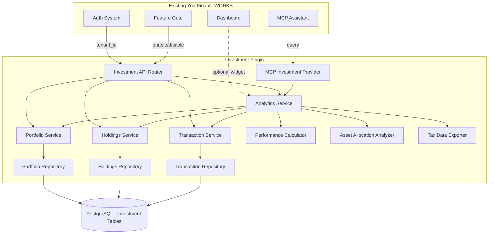

# Design Document: Investment Management

## Overview

The investment management feature extends YourFinanceWORKS with comprehensive portfolio tracking, performance analytics, and tax reporting capabilities. The system follows a multi-tenant architecture where each tenant (personal user or business) can manage multiple portfolios containing various investment holdings.

The design emphasizes data integrity, accurate financial calculations, and seamless integration with the existing MCP-powered AI assistant. The implementation uses a relational database model with clear separation between portfolios, holdings, and transactions to ensure accurate cost basis tracking and performance calculations.

Key design principles:
- **Multi-tenant isolation**: Strict data separation between tenants
- **Immutable transactions**: Transaction history is append-only for audit trails
- **Flexible cost basis tracking**: Support for FIFO and future cost basis methods
- **Integration-ready**: Designed for future API integrations while supporting manual entry
- **AI-accessible**: Data structures optimized for MCP assistant queries

## Architecture

### Plugin-Based Design

The investment management feature is designed as a **self-contained plugin module** to minimize impact on existing YourFinanceWORKS code. This modular approach ensures:

- **Isolated codebase**: All investment code lives in a dedicated module/package
- **Independent database tables**: New tables with no foreign keys to existing tables (except tenant_id)
- **Separate API routes**: All investment endpoints under `/api/v1/investments/*`
- **Optional feature**: Can be enabled/disabled via feature flags
- **Zero breaking changes**: No modifications to existing financial tracking features

### Plugin Integration Points

The investment plugin integrates with existing YourFinanceWORKS through:

1. **Tenant ID**: Uses existing tenant authentication and tenant_id for multi-tenancy
2. **MCP Assistant**: Registers investment data providers with existing MCP infrastructure
3. **Dashboard**: Provides optional dashboard widgets (can be conditionally rendered)
4. **Navigation**: Adds menu items via plugin registration (if feature enabled)
5. **Feature Flags**: Respects existing feature gate system for license-based access

### System Components

The investment management system consists of four primary layers:

1. **API Layer**: RESTful endpoints for portfolio, holding, and transaction operations
2. **Service Layer**: Business logic for calculations, validations, and data transformations
3. **Data Layer**: Database models and repositories for persistent storage
4. **Integration Layer**: Interfaces for MCP assistant and future external APIs

### Plugin Module Structure

```
api/
  plugins/                  # Plugins directory
    investments/            # Investment plugin module
      __init__.py          # Plugin registration
      router.py            # API endpoints
      models.py            # Database models
      schemas.py           # Pydantic schemas
      services/
        portfolio_service.py
        holdings_service.py
        transaction_service.py
        analytics_service.py
      repositories/
        portfolio_repository.py
        holdings_repository.py
        transaction_repository.py
      calculators/
        performance_calculator.py
        allocation_analyzer.py
        tax_data_exporter.py
      mcp/
        investment_provider.py  # MCP integration
      migrations/
        001_create_investment_tables.sql
```

### Component Diagram



### Data Flow

1. **Portfolio Creation**: User → Auth → Feature Gate → Investment API → Portfolio Service → Portfolio Repository → Investment DB
2. **Transaction Recording**: User → Auth → Investment API → Transaction Service → (Update Holdings) → Holdings Service → Investment DB
3. **Performance Query**: User → Auth → Investment API → Analytics Service → (Aggregate data) → Holdings/Transaction Services → Response
4. **AI Query**: MCP Assistant → MCP Investment Provider → Analytics Service → Services → Formatted Response

### Plugin Registration

The investment plugin registers itself with the main application:

```python
# api/plugins/investments/__init__.py
from fastapi import APIRouter
from .router import investment_router
from .mcp.investment_provider import InvestmentMCPProvider

def register_investment_plugin(app, mcp_registry, feature_gate):
    """
    Register the investment management plugin with the main application.
    This is a COMMERCIAL feature requiring a commercial license.

    Args:
        app: FastAPI application instance
        mcp_registry: MCP provider registry
        feature_gate: Feature gate service
    """
    # Register API routes under /api/v1/investments
    # All routes protected by commercial license requirement
    app.include_router(
        investment_router,
        prefix="/api/v1/investments",
        tags=["investments"],
        dependencies=[Depends(feature_gate.require_feature("investments", tier="commercial"))]
    )

    # Register MCP provider for AI assistant
    mcp_registry.register_provider("investments", InvestmentMCPProvider())

    return {
        "name": "investment-management",
        "version": "1.0.0",
        "license_tier": "commercial",
        "routes": ["/api/v1/investments"],
        "mcp_providers": ["investments"]
    }
```

### Database Isolation

All investment tables are prefixed with `investment_` and have no foreign key constraints to existing tables (except tenant_id which is a simple reference, not a constraint). This allows:

- Independent schema migrations
- Easy plugin removal if needed
- No cascading deletes affecting existing data
- Clear separation of concerns

### Feature Flag Integration

The investment plugin is a **commercial feature** and requires a commercial license. It respects the existing feature gate system:

```python
# All investment endpoints protected by commercial feature gate
@router.get("/portfolios")
async def get_portfolios(
    tenant_id: UUID = Depends(get_current_tenant),
    feature_gate: FeatureGate = Depends(require_feature("investments", tier="commercial"))
):
    # Implementation
    pass
```

**License Requirements**:
- Feature name: `investments`
- License tier: `commercial`
- Feature gate check: Required on all investment endpoints
- UI components: Conditionally rendered based on license

This ensures the investment management feature is only accessible to users with commercial licenses, without modifying existing code.

## Components and Interfaces

### Database Models

#### Portfolio Model

```python
class Portfolio:
    id: UUID
    tenant_id: UUID
    name: str
    portfolio_type: PortfolioType  # TAXABLE, RETIREMENT, BUSINESS
    created_at: datetime
    updated_at: datetime
    is_archived: bool
```

#### Holding Model

```python
class Holding:
    id: UUID
    portfolio_id: UUID
    security_symbol: str
    security_name: str
    security_type: SecurityType  # STOCK, BOND, ETF, MUTUAL_FUND, CASH
    asset_class: AssetClass  # STOCKS, BONDS, CASH, REAL_ESTATE, COMMODITIES
    quantity: Decimal
    cost_basis: Decimal  # Total cost basis for all shares
    average_cost_per_share: Decimal  # Computed field
    purchase_date: date  # Initial purchase date for the holding
    current_price: Decimal
    price_updated_at: datetime
    is_closed: bool
    created_at: datetime
    updated_at: datetime
```

#### Transaction Model

```python
class Transaction:
    id: UUID
    portfolio_id: UUID
    holding_id: UUID
    transaction_type: TransactionType  # BUY, SELL, DIVIDEND, INTEREST, FEE, TRANSFER, CONTRIBUTION
    transaction_date: date
    quantity: Decimal
    price_per_share: Decimal
    total_amount: Decimal
    fees: Decimal
    realized_gain: Decimal  # For SELL transactions (simple average cost basis)
    dividend_type: DividendType  # ORDINARY (for DIVIDEND transactions)
    payment_date: date  # For DIVIDEND transactions (when dividend was paid)
    ex_dividend_date: date  # For DIVIDEND transactions (ex-dividend date)
    notes: str
    created_at: datetime
```

### API Endpoints

#### Portfolio Endpoints

```
POST   /api/v1/investments/portfolios
GET    /api/v1/investments/portfolios
GET    /api/v1/investments/portfolios/{portfolio_id}
PUT    /api/v1/investments/portfolios/{portfolio_id}
DELETE /api/v1/investments/portfolios/{portfolio_id}
```

#### Holdings Endpoints

```
POST   /api/v1/investments/portfolios/{portfolio_id}/holdings
GET    /api/v1/investments/portfolios/{portfolio_id}/holdings
GET    /api/v1/investments/holdings/{holding_id}
PUT    /api/v1/investments/holdings/{holding_id}
PATCH  /api/v1/investments/holdings/{holding_id}/price
```

#### Transaction Endpoints

```
POST   /api/v1/investments/portfolios/{portfolio_id}/transactions
GET    /api/v1/investments/portfolios/{portfolio_id}/transactions
GET    /api/v1/investments/transactions/{transaction_id}
```

#### Analytics Endpoints

```
GET    /api/v1/investments/portfolios/{portfolio_id}/performance
GET    /api/v1/investments/portfolios/{portfolio_id}/allocation
GET    /api/v1/investments/portfolios/{portfolio_id}/dividends
GET    /api/v1/investments/portfolios/{portfolio_id}/tax-export
```

### Service Interfaces

#### Portfolio Service

```python
class PortfolioService:
    def create_portfolio(tenant_id: UUID, name: str, portfolio_type: PortfolioType) -> Portfolio
    def get_portfolios(tenant_id: UUID) -> List[Portfolio]
    def get_portfolio(portfolio_id: UUID, tenant_id: UUID) -> Portfolio
    def update_portfolio(portfolio_id: UUID, tenant_id: UUID, updates: dict) -> Portfolio
    def delete_portfolio(portfolio_id: UUID, tenant_id: UUID) -> bool
    def validate_tenant_access(portfolio_id: UUID, tenant_id: UUID) -> bool
```

#### Holdings Service

```python
class HoldingsService:
    def create_holding(portfolio_id: UUID, security_data: dict) -> Holding
    def get_holdings(portfolio_id: UUID) -> List[Holding]
    def get_holding(holding_id: UUID) -> Holding
    def update_holding(holding_id: UUID, updates: dict) -> Holding
    def update_price(holding_id: UUID, price: Decimal) -> Holding
    def adjust_quantity(holding_id: UUID, quantity_delta: Decimal, cost_delta: Decimal) -> Holding
    def close_holding(holding_id: UUID) -> Holding
```

#### Transaction Service

```python
class TransactionService:
    def record_transaction(portfolio_id: UUID, transaction_data: dict) -> Transaction
    def get_transactions(portfolio_id: UUID, start_date: date, end_date: date) -> List[Transaction]
    def get_transaction(transaction_id: UUID) -> Transaction
    def process_buy(portfolio_id: UUID, transaction_data: dict) -> Transaction
    def process_sell(portfolio_id: UUID, transaction_data: dict) -> Transaction
    def process_dividend(portfolio_id: UUID, transaction_data: dict) -> Transaction
    def process_interest(portfolio_id: UUID, transaction_data: dict) -> Transaction  # Record only, no holding change
    def process_fee(portfolio_id: UUID, transaction_data: dict) -> Transaction  # Record only, no holding change
    def process_transfer(portfolio_id: UUID, transaction_data: dict) -> Transaction  # Record only, no holding change
    def process_contribution(portfolio_id: UUID, transaction_data: dict) -> Transaction  # Record only, no holding change
    def calculate_realized_gain(holding: Holding, sell_quantity: Decimal, sell_price: Decimal) -> Decimal  # Uses simple average cost
```

#### Analytics Service

```python
class AnalyticsService:
    def calculate_portfolio_performance(portfolio_id: UUID) -> PerformanceMetrics  # Inception-to-date only
    def calculate_asset_allocation(portfolio_id: UUID) -> AssetAllocation
    def calculate_dividend_income(portfolio_id: UUID, start_date: date, end_date: date) -> DividendSummary
    def export_tax_data(portfolio_id: UUID, tax_year: int) -> TaxExport
    def calculate_total_return(holdings: List[Holding], transactions: List[Transaction]) -> Decimal
    def calculate_unrealized_gains(holdings: List[Holding]) -> Decimal
    def calculate_realized_gains(transactions: List[Transaction]) -> Decimal
```

## Data Models

### Enumerations

```python
class PortfolioType(Enum):
    TAXABLE = "taxable"
    RETIREMENT = "retirement"  # Generic retirement account
    BUSINESS = "business"

class SecurityType(Enum):
    STOCK = "stock"
    BOND = "bond"
    ETF = "etf"
    MUTUAL_FUND = "mutual_fund"
    CASH = "cash"

class AssetClass(Enum):
    STOCKS = "stocks"
    BONDS = "bonds"
    CASH = "cash"
    REAL_ESTATE = "real_estate"
    COMMODITIES = "commodities"

class TransactionType(Enum):
    BUY = "buy"
    SELL = "sell"
    DIVIDEND = "dividend"
    INTEREST = "interest"
    FEE = "fee"
    TRANSFER = "transfer"
    CONTRIBUTION = "contribution"

class DividendType(Enum):
    ORDINARY = "ordinary"  # MVP uses single type
```

### Response Models

```python
class PerformanceMetrics:
    total_value: Decimal
    total_cost: Decimal
    total_gain_loss: Decimal
    total_return_percentage: Decimal  # Inception-to-date only in MVP
    unrealized_gain_loss: Decimal
    realized_gain_loss: Decimal

class AssetAllocation:
    allocations: Dict[AssetClass, AllocationDetail]
    total_value: Decimal

class AllocationDetail:
    asset_class: AssetClass
    value: Decimal
    percentage: Decimal
    holdings_count: int

class DividendSummary:
    total_dividends: Decimal
    dividend_transactions: List[Transaction]
    period_start: date
    period_end: date

class TaxExport:
    tax_year: int
    total_realized_gains: Decimal  # Raw amount, no classification
    total_dividends: Decimal  # Raw amount, no classification
    transactions: List[Transaction]
```

### Business Logic Algorithms

#### Cost Basis Calculation (Simple Average Cost)

When selling shares, the MVP uses simple average cost basis:

```python
def calculate_average_cost_basis(holding: Holding, sell_quantity: Decimal) -> Decimal:
    """
    Calculate cost basis for a sell transaction using simple average cost method.
    Returns total cost basis for the shares being sold.
    """
    # Use the holding's average cost per share
    average_cost = holding.cost_basis / holding.quantity

    # Calculate total cost basis for shares being sold
    total_cost_basis = sell_quantity * average_cost

    return total_cost_basis
```

#### Total Return Calculation

```python
def calculate_total_return(holdings: List[Holding], transactions: List[Transaction]) -> Decimal:
    """
    Calculate total return percentage for a portfolio.
    Return = (Current Value + Total Sell Proceeds + Dividends - Total Buy Cost) / Total Buy Cost
    """
    current_value = sum(h.quantity * h.current_price for h in holdings)

    # Total buy cost is sum of all BUY transactions
    total_buy_cost = sum(
        tx.total_amount for tx in transactions
        if tx.transaction_type == TransactionType.BUY
    )

    # Total sell proceeds from all SELL transactions
    total_sell_proceeds = sum(
        tx.total_amount for tx in transactions
        if tx.transaction_type == TransactionType.SELL
    )

    # Add dividend income
    dividends = sum(
        tx.total_amount for tx in transactions
        if tx.transaction_type == TransactionType.DIVIDEND
    )

    if total_buy_cost == 0:
        return Decimal(0)

    total_return = (current_value + total_sell_proceeds + dividends - total_buy_cost) / total_buy_cost

    return total_return * 100  # Return as percentage
```

#### Asset Allocation Calculation

```python
def calculate_asset_allocation(portfolio_id: UUID) -> AssetAllocation:
    """
    Calculate asset allocation by asset class.
    """
    holdings = get_holdings(portfolio_id)

    allocation_map = {}
    total_value = Decimal(0)

    for holding in holdings:
        if holding.is_closed:
            continue

        holding_value = holding.quantity * holding.current_price
        total_value += holding_value

        asset_class = holding.asset_class
        if asset_class not in allocation_map:
            allocation_map[asset_class] = {
                "value": Decimal(0),
                "holdings_count": 0
            }

        allocation_map[asset_class]["value"] += holding_value
        allocation_map[asset_class]["holdings_count"] += 1

    # Calculate percentages
    allocations = {}
    for asset_class, data in allocation_map.items():
        percentage = (data["value"] / total_value * 100) if total_value > 0 else Decimal(0)
        allocations[asset_class] = AllocationDetail(
            asset_class=asset_class,
            value=data["value"],
            percentage=percentage,
            holdings_count=data["holdings_count"]
        )

    return AssetAllocation(
        allocations=allocations,
        total_value=total_value
    )
```

## MCP Assistant Integration

The investment system exposes data to the MCP assistant through a dedicated integration interface:

```python
class MCPInvestmentInterface:
    def get_portfolio_summary(tenant_id: UUID) -> dict
    def get_holding_details(tenant_id: UUID, symbol: str) -> dict
    def get_performance_summary(tenant_id: UUID, portfolio_id: UUID) -> dict
    def get_dividend_forecast(tenant_id: UUID, portfolio_id: UUID) -> dict
    def get_tax_summary(tenant_id: UUID, tax_year: int) -> dict
```

The MCP assistant can answer queries like:
- "What's my overall portfolio performance?"
- "How much dividend income did I receive last quarter?"
- "What's my asset allocation?"
- "Show me my realized capital gains for tax year 2024"
- "What are my largest holdings?"


## Correctness Properties

*A property is a characteristic or behavior that should hold true across all valid executions of a system—essentially, a formal statement about what the system should do. Properties serve as the bridge between human-readable specifications and machine-verifiable correctness guarantees.*

### Property Reflection

After analyzing all acceptance criteria, I identified several areas of redundancy:

1. **Tenant isolation properties (1.4, 8.1, 8.2, 8.3, 8.4, 9.3)** can be consolidated into comprehensive tenant isolation properties
2. **Data completeness properties** (2.1, 3.5, 4.6, 6.2, 11.2) can be combined into properties about required fields
3. **Support for enumeration types** (1.3, 2.2, 3.1, 5.2, 6.5, 12.1) can be tested through the same property pattern
4. **Calculation properties** (4.1, 4.3, 4.4, 4.5) can be consolidated into comprehensive return calculation properties
5. **Input validation properties** (2.5, 3.6, 10.2, 10.3) can be grouped by validation type

The following properties represent the unique, non-redundant correctness guarantees:

### Portfolio Management Properties

**Property 1: Portfolio creation and tenant association**
*For any* tenant and portfolio data, when creating a portfolio, the resulting portfolio should be associated with that tenant and retrievable by that tenant.
**Validates: Requirements 1.1, 1.2**

**Property 2: Portfolio type support**
*For any* valid portfolio type (TAXABLE, RETIREMENT, BUSINESS), the system should successfully create a portfolio of that type.
**Validates: Requirements 1.3, 12.1**

**Property 3: Tenant isolation for portfolios**
*For any* tenant, querying portfolios should return only portfolios where the portfolio's tenant_id matches the requesting tenant's id, and should never return portfolios belonging to other tenants.
**Validates: Requirements 1.4, 8.1, 8.4**

**Property 4: Portfolio update persistence**
*For any* portfolio and valid update data (name or type), updating the portfolio should result in the portfolio having the new values when subsequently retrieved.
**Validates: Requirements 1.5**

**Property 5: Portfolio deletion with holdings constraint**
*For any* portfolio with zero holdings, deletion should succeed; for any portfolio with one or more holdings, deletion should fail with an appropriate error.
**Validates: Requirements 1.6**

### Holdings Management Properties

**Property 6: Holding creation completeness**
*For any* holding creation with required fields (security_symbol, quantity, cost_basis, security_type, asset_class), the stored holding should contain all provided fields.
**Validates: Requirements 2.1**

**Property 7: Security type support**
*For any* valid security type (STOCK, BOND, ETF, MUTUAL_FUND, CASH), the system should successfully create a holding of that type.
**Validates: Requirements 2.2**

**Property 8: Holdings retrieval completeness**
*For any* portfolio, retrieving holdings should return all non-deleted holdings with quantity and cost_basis fields populated.
**Validates: Requirements 2.3**

**Property 9: Holding update persistence**
*For any* holding and valid update data (quantity or cost_basis), updating the holding should result in the new values being stored and retrievable.
**Validates: Requirements 2.4**

**Property 10: Negative quantity rejection**
*For any* attempt to create or update a holding with negative quantity, the operation should be rejected with a validation error.
**Validates: Requirements 2.5**

**Property 11: Holding closure on zero quantity**
*For any* holding, when its quantity is updated to zero, the holding should be marked as closed (is_closed = true) but the holding record should still exist and be retrievable.
**Validates: Requirements 2.6**

**Property 12: Tenant isolation for holdings**
*For any* tenant, retrieving holdings should return only holdings from portfolios owned by that tenant.
**Validates: Requirements 8.2**

### Transaction Management Properties

**Property 13: Transaction type support**
*For any* valid transaction type (BUY, SELL, DIVIDEND, INTEREST, FEE, TRANSFER, CONTRIBUTION), the system should successfully create a transaction of that type.
**Validates: Requirements 3.1**

**Property 14: Buy transaction effects**
*For any* holding and buy transaction, recording the buy should increase the holding's quantity by the transaction quantity and increase the cost_basis by the transaction total_amount.
**Validates: Requirements 3.2**

**Property 15: Sell transaction effects**
*For any* holding with sufficient quantity and sell transaction, recording the sell should decrease the holding's quantity by the transaction quantity and calculate a realized_gain value.
**Validates: Requirements 3.3**

**Property 16: Dividend transaction invariant**
*For any* holding and dividend transaction, recording the dividend should not change the holding's quantity.
**Validates: Requirements 3.4**

**Property 17: Transaction data completeness**
*For any* transaction creation with required fields (transaction_type, transaction_date, total_amount), the stored transaction should contain all provided fields.
**Validates: Requirements 3.5**

**Property 18: Sell quantity validation**
*For any* sell transaction where the quantity exceeds the holding's current quantity, the operation should be rejected with a validation error.
**Validates: Requirements 3.6**

**Property 19: Transaction ordering**
*For any* portfolio, retrieving transactions should return them ordered by transaction_date in ascending order.
**Validates: Requirements 3.7**

**Property 20: Tenant isolation for transactions**
*For any* tenant, retrieving transactions should return only transactions from portfolios owned by that tenant.
**Validates: Requirements 8.3**

### Performance Analytics Properties

**Property 21: Total return calculation**
*For any* portfolio with holdings and transactions, the total return percentage should equal ((current_value + total_sell_proceeds + dividends - total_buy_cost) / total_buy_cost) * 100, where total_buy_cost is the sum of all BUY transaction amounts and total_sell_proceeds is the sum of all SELL transaction amounts.
**Validates: Requirements 4.1, 4.3**

**Property 22: Performance calculation completeness**
*For any* portfolio performance request, the response should include total_value, total_cost, total_gain_loss, and total_return_percentage fields for inception-to-date.
**Validates: Requirements 4.2, 4.6**

**Property 23: Unrealized gain calculation**
*For any* holding, the unrealized gain should equal (quantity * current_price) - cost_basis.
**Validates: Requirements 4.4**

**Property 24: Realized gain aggregation**
*For any* portfolio, the total realized gains should equal the sum of realized_gain from all SELL transactions.
**Validates: Requirements 4.5**

### Asset Allocation Properties

**Property 25: Asset allocation grouping**
*For any* portfolio, the asset allocation should group holdings by asset_class and sum their values.
**Validates: Requirements 5.1**

**Property 26: Asset class support**
*For any* valid asset class (STOCKS, BONDS, CASH, REAL_ESTATE, COMMODITIES), the system should successfully categorize holdings in that class.
**Validates: Requirements 5.2**

**Property 27: Allocation percentage calculation**
*For any* portfolio with holdings, the sum of all asset class allocation percentages should equal 100%, and each percentage should equal (asset_class_value / total_value) * 100.
**Validates: Requirements 5.3**

**Property 28: Asset class assignment**
*For any* holding, it should have an asset_class value assigned either from security_type mapping or manual classification.
**Validates: Requirements 5.4**

### Dividend Tracking Properties

**Property 29: Dividend holding association**
*For any* dividend transaction, it should have a valid holding_id that references an existing holding in the same portfolio.
**Validates: Requirements 6.1**

**Property 30: Dividend data completeness**
*For any* dividend transaction, it should include total_amount, transaction_date, and dividend_type fields.
**Validates: Requirements 6.2**

**Property 31: Dividend history filtering**
*For any* portfolio and time period, retrieving dividend history should return only dividend transactions where transaction_date falls within the specified period.
**Validates: Requirements 6.3**

**Property 32: Dividend income aggregation**
*For any* portfolio and time period, total dividend income should equal the sum of total_amount from all dividend transactions in that period.
**Validates: Requirements 6.4**

**Property 33: Dividend type support**
*For any* dividend transaction, the system should successfully create it with ORDINARY type.
**Validates: Requirements 6.5**

### Tax Reporting Properties

**Property 34: Tax export completeness**
*For any* tax year request, the tax export should include all transactions with realized gains and dividend amounts as raw data.
**Validates: Requirements 7.1, 7.2, 7.3**

**Property 35: Average cost basis calculation**
*For any* holding with multiple buy transactions and a sell transaction, the cost basis should be calculated using simple average cost (total cost basis / total quantity).
**Validates: Requirements 7.5**

**Property 36: Cost basis consistency**
*For any* holding, the current cost_basis should equal the sum of all BUY transaction amounts minus the cost basis of all SELL transactions for that holding.
**Validates: Requirements 10.4**

### Data Validation Properties

**Property 37: Required field validation**
*For any* transaction creation missing required fields (transaction_type, transaction_date, or total_amount), the operation should be rejected with a validation error.
**Validates: Requirements 10.1**

**Property 38: Positive amount validation**
*For any* transaction with negative total_amount or negative quantity, the operation should be rejected with a validation error.
**Validates: Requirements 10.2**

**Property 39: Future date validation**
*For any* transaction with transaction_date in the future, the operation should be rejected with a validation error.
**Validates: Requirements 10.3**

**Property 40: Duplicate transaction prevention**
*For any* two transactions with identical portfolio_id, transaction_type, transaction_date, quantity, and total_amount created within 60 seconds, the second should be rejected as a duplicate.
**Validates: Requirements 10.5**

### Price Management Properties

**Property 41: Manual price update**
*For any* holding and valid price value, updating the price should result in the holding having the new current_price and an updated price_updated_at timestamp.
**Validates: Requirements 11.1, 11.2**

**Property 42: Latest price usage**
*For any* holding with multiple price updates, the current_price should be the most recently updated price based on price_updated_at.
**Validates: Requirements 11.3**

**Property 43: Price fallback to cost basis**
*For any* holding where current_price is null or zero, portfolio valuation should use (cost_basis / quantity) as the price per share.
**Validates: Requirements 11.4**

**Property 44: Price timestamp presence**
*For any* holding with a current_price, the price_updated_at field should be populated.
**Validates: Requirements 11.5**

### Retirement Account Properties

**Property 45: Retirement portfolio type tracking**
*For any* portfolio designated as a retirement account (RETIREMENT), the portfolio_type should be stored and retrievable.
**Validates: Requirements 12.2**

**Property 46: Retirement contribution tracking**
*For any* retirement portfolio, the system should accept CONTRIBUTION transaction types.
**Validates: Requirements 12.3**

### Business Investment Properties

**Property 47: Business portfolio creation**
*For any* business tenant, creating a portfolio with portfolio_type BUSINESS should succeed and associate the portfolio with that tenant.
**Validates: Requirements 13.1, 13.2**

**Property 48: Business security tracking**
*For any* business portfolio, the system should support all security types (STOCK, BOND, ETF, MUTUAL_FUND, CASH).
**Validates: Requirements 13.3**

**Property 49: Business data separation**
*For any* report or query with a portfolio_type filter, results should only include portfolios matching the specified type (BUSINESS vs personal types).
**Validates: Requirements 13.4**

### Data Retention Properties

**Property 50: Transaction immutability**
*For any* transaction, once created, it should remain in the database indefinitely and not be deleted (only soft-deleted if necessary).
**Validates: Requirements 14.1**

**Property 51: Closed holding transaction preservation**
*For any* holding marked as closed (is_closed = true), all associated transactions should remain in the database and be retrievable.
**Validates: Requirements 14.2**

**Property 52: Portfolio archival on deletion**
*For any* portfolio deletion, the portfolio should be marked as archived (is_archived = true) rather than being permanently deleted from the database.
**Validates: Requirements 14.4**

### Error Handling Properties

**Property 53: Non-existent resource error**
*For any* request to access a portfolio, holding, or transaction with an ID that doesn't exist, the system should return a 404 Not Found error.
**Validates: Requirements 15.2**


## Error Handling

The investment system implements comprehensive error handling to ensure data integrity and provide clear feedback to users.

### Error Categories

#### Validation Errors (400 Bad Request)

- Missing required fields in requests
- Invalid data types or formats
- Negative quantities or amounts
- Future transaction dates
- Insufficient holdings for sell transactions
- Invalid portfolio types, security types, or transaction types

#### Authorization Errors (403 Forbidden)

- Tenant attempting to access another tenant's portfolio
- Tenant attempting to modify another tenant's holdings or transactions
- Invalid or expired authentication tokens

#### Not Found Errors (404 Not Found)

- Portfolio ID does not exist
- Holding ID does not exist
- Transaction ID does not exist
- Tenant ID does not exist

#### Conflict Errors (409 Conflict)

- Attempting to delete a portfolio with holdings
- Duplicate transaction detection
- Data consistency violations

#### Server Errors (500 Internal Server Error)

- Database connection failures
- Calculation errors due to unexpected data states
- Unhandled exceptions

### Error Response Format

All errors return a consistent JSON structure:

```json
{
  "error": {
    "code": "VALIDATION_ERROR",
    "message": "Transaction quantity cannot be negative",
    "details": {
      "field": "quantity",
      "value": -10,
      "constraint": "must be positive"
    },
    "timestamp": "2024-01-15T10:30:00Z",
    "request_id": "req_abc123"
  }
}
```

### Transaction Rollback

All database operations that modify multiple records (e.g., recording a buy transaction that updates both transactions and holdings tables) are wrapped in database transactions. If any operation fails, all changes are rolled back to maintain data consistency.

### Logging

All errors are logged with:
- Request ID for tracing
- Tenant ID (when available)
- Error type and message
- Stack trace for server errors
- Timestamp
- Request parameters (sanitized)

## Testing Strategy

The investment management feature requires comprehensive testing to ensure financial calculations are accurate and data integrity is maintained. We employ a dual testing approach combining unit tests and property-based tests.

### Testing Approach

**Unit Tests**: Verify specific examples, edge cases, and error conditions
- Specific transaction scenarios (buy, sell, dividend)
- Edge cases (zero quantity, empty portfolios, missing prices)
- Error conditions (negative amounts, insufficient holdings)
- Integration points (MCP assistant interface)

**Property-Based Tests**: Verify universal properties across all inputs
- Financial calculation correctness (returns, gains, allocations)
- Data integrity invariants (cost basis consistency)
- Tenant isolation guarantees
- Simple average cost basis algorithm
- Comprehensive input coverage through randomization

### Property-Based Testing Configuration

**Library**: We will use **Hypothesis** for Python (or **fast-check** for TypeScript if implemented in TypeScript)

**Configuration**:
- Minimum 100 iterations per property test
- Each property test references its design document property
- Tag format: `# Feature: investment-management, Property {number}: {property_text}`

**Example Property Test Structure**:

```python
from hypothesis import given, strategies as st
import pytest

@given(
    tenant_id=st.uuids(),
    portfolio_name=st.text(min_size=1, max_size=100),
    portfolio_type=st.sampled_from(["TAXABLE", "RETIREMENT", "BUSINESS"])
)
@pytest.mark.property_test
def test_portfolio_creation_and_tenant_association(tenant_id, portfolio_name, portfolio_type):
    """
    Feature: investment-management, Property 1: Portfolio creation and tenant association
    For any tenant and portfolio data, when creating a portfolio, the resulting portfolio
    should be associated with that tenant and retrievable by that tenant.
    """
    # Create portfolio
    portfolio = create_portfolio(tenant_id, portfolio_name, portfolio_type)

    # Verify association
    assert portfolio.tenant_id == tenant_id

    # Verify retrievability
    retrieved_portfolios = get_portfolios(tenant_id)
    assert portfolio.id in [p.id for p in retrieved_portfolios]
```

### Test Coverage Requirements

**Unit Test Coverage**:
- All API endpoints (happy path and error cases)
- All service methods
- All calculation functions
- Edge cases identified in requirements
- MCP assistant integration

**Property Test Coverage**:
- All 59 correctness properties from the design document
- Each property implemented as a separate test
- Minimum 100 iterations per test

### Critical Test Scenarios

1. **Average Cost Basis**: Multiple buy transactions followed by partial sells
2. **Tenant Isolation**: Attempts to access other tenants' data
3. **Transaction Consistency**: Buy/sell transactions updating holdings correctly
4. **Performance Calculations**: Returns accounting for dividends and realized gains
5. **Asset Allocation**: Percentages summing to 100%
6. **Negative Quantity Prevention**: Validation of sell transactions
7. **Portfolio Deletion**: Constraint enforcement for portfolios with holdings
8. **Price Fallback**: Using cost basis when current price unavailable
9. **Duplicate Prevention**: Identical transactions within time window

### Integration Testing

Integration tests verify:
- Database transactions and rollbacks
- Multi-tenant data isolation at database level
- MCP assistant data retrieval
- API authentication and authorization
- End-to-end transaction flows (create portfolio → add holding → record transactions → calculate performance)

### Performance Testing

While not part of initial implementation, performance tests should eventually verify:
- Portfolio performance calculation with large transaction histories
- Asset allocation calculation with many holdings
- Query performance with tenant isolation filters
- Concurrent transaction recording

### Test Data Generation

For property-based tests, we generate:
- Random tenant IDs (UUIDs)
- Random portfolio names and types
- Random security symbols (3-5 uppercase letters)
- Random quantities (positive decimals)
- Random prices (positive decimals, typically $1-$1000)
- Random dates (past dates only)
- Random transaction types

Constraints on generated data:
- Quantities must be positive
- Prices must be positive
- Dates must not be in the future
- Sell quantities must not exceed holding quantities
- Transaction amounts must be consistent with quantity * price

### Continuous Testing

All tests run on:
- Every commit (via CI/CD pipeline)
- Before merging pull requests
- Nightly builds (extended property test iterations)

Property-based tests use a fixed random seed in CI to ensure reproducibility while still providing comprehensive coverage.


## Future Plugin Opportunities

The plugin architecture established for investment management can be extended to other financial features. The system can support both **official commercial plugins** and **community-contributed plugins**.

### Plugin Distribution Model

#### Official Commercial Plugins (YourFinanceWORKS)
- Developed and maintained by YourFinanceWORKS team
- Require commercial/enterprise licenses
- Full support and updates guaranteed
- Integrated with feature gate system
- Examples: Investment Management, Payroll, Multi-Currency

#### Community Plugins (Open Source)
- Developed by community contributors
- Free to use (or community-priced)
- Distributed via plugin marketplace/registry
- Follow same technical architecture
- Community support model
- Optional certification/verification by YourFinanceWORKS

### Community Plugin Architecture

To support community plugins, the system needs:

```python
# Plugin manifest (plugin.json)
{
  "name": "custom-reports",
  "version": "1.0.0",
  "author": "Community Developer",
  "license": "MIT",
  "type": "community",  # or "official"
  "requires_license_tier": "free",  # free, commercial, enterprise
  "description": "Custom financial reports",
  "api_routes": ["/api/v1/custom-reports"],
  "mcp_providers": ["custom-reports"],
  "ui_components": ["CustomReportsDashboard"],
  "dependencies": {
    "yourfinanceworks": ">=2.0.0",
    "python": ">=3.10"
  },
  "permissions": [
    "read:expenses",
    "read:invoices",
    "write:reports"
  ]
}
```

#### Plugin Installation Flow

1. **Discovery**: User browses plugin marketplace (web UI or CLI)
2. **Installation**: `yfworks plugin install custom-reports` or via admin UI
3. **Verification**: System checks plugin signature and permissions
4. **Registration**: Plugin registers routes, MCP providers, UI components
5. **Activation**: User enables plugin for their tenant
6. **Updates**: Automatic or manual plugin updates

#### Plugin Security & Sandboxing

Community plugins must be sandboxed:
- **Permission system**: Plugins declare required permissions
- **Data access control**: Plugins can only access data they have permission for
- **API rate limiting**: Prevent abuse
- **Code review**: Optional certification process for verified plugins
- **Tenant isolation**: Plugins respect multi-tenant boundaries
- **Resource limits**: CPU, memory, storage quotas

#### Plugin Marketplace

A plugin marketplace would include:
- **Search & discovery**: Browse by category, rating, popularity
- **Ratings & reviews**: Community feedback
- **Documentation**: Installation guides, API docs
- **Version management**: Compatible versions, changelogs
- **Security badges**: Verified, certified, community-reviewed
- **Pricing**: Free, freemium, paid community plugins

### Example Community Plugin Ideas

1. **Custom Report Builder**: Visual report designer
2. **Industry-Specific Templates**: Construction, retail, healthcare templates
3. **Third-Party Integrations**: Stripe, Square, QuickBooks sync
4. **Advanced Visualizations**: Custom charts and dashboards
5. **Workflow Automation**: Custom approval workflows
6. **Email Templates**: Branded invoice and statement templates
7. **Mobile Notifications**: Push notifications for events
8. **Backup & Export**: Enhanced backup and data export tools
9. **Custom Fields**: Add custom fields to existing entities
10. **Regional Compliance**: Country-specific tax and compliance rules

### Official Commercial Plugin Opportunities

Here are potential official commercial plugins that could follow the same pattern as investment management:

### 1. Budgeting & Forecasting Plugin
- **Features**: Budget creation, spending forecasts, variance analysis, budget alerts
- **Integration**: Links to existing expense tracking
- **License Tier**: Commercial
- **Value**: Helps businesses and individuals plan and control spending

### 2. Multi-Currency & Foreign Exchange Plugin
- **Features**: Multi-currency accounts, FX rate tracking, currency conversion, FX gain/loss reporting
- **Integration**: Extends invoices, expenses, and payments with currency support
- **License Tier**: Commercial
- **Value**: Essential for international businesses

### 3. Payroll Management Plugin
- **Features**: Employee records, salary processing, tax withholding, payroll reports, direct deposit
- **Integration**: Links to expense tracking for payroll expenses
- **License Tier**: Commercial
- **Value**: Simplifies payroll for small businesses

### 4. Inventory Management Plugin
- **Features**: Product catalog, stock tracking, reorder points, COGS calculation, inventory valuation
- **Integration**: Links to invoices (products sold) and expenses (inventory purchased)
- **License Tier**: Commercial
- **Value**: Critical for product-based businesses

### 5. Project & Job Costing Plugin
- **Features**: Project tracking, time tracking, expense allocation, profitability analysis
- **Integration**: Links expenses and invoices to projects
- **License Tier**: Commercial
- **Value**: Essential for service businesses and contractors

### 6. Advanced Tax Planning Plugin
- **Features**: Tax scenario modeling, deduction optimization, quarterly estimates, tax strategy recommendations
- **Integration**: Uses data from all financial modules
- **License Tier**: Premium/Enterprise
- **Value**: Sophisticated tax planning for high-value clients

### 7. Financial Consolidation Plugin
- **Features**: Multi-entity consolidation, intercompany eliminations, consolidated reporting
- **Integration**: Aggregates data across multiple business tenants
- **License Tier**: Enterprise
- **Value**: Required for businesses with multiple entities

### 8. Loan & Debt Management Plugin
- **Features**: Loan tracking, amortization schedules, interest calculation, debt payoff planning
- **Integration**: Links to cash flow and expense tracking
- **License Tier**: Commercial
- **Value**: Helps manage business and personal debt

### 9. Subscription & Recurring Revenue Plugin
- **Features**: Subscription management, MRR/ARR tracking, churn analysis, renewal forecasting
- **Integration**: Extends invoicing with subscription logic
- **License Tier**: Commercial
- **Value**: Critical for SaaS and subscription businesses

### 10. Compliance & Audit Trail Plugin
- **Features**: Enhanced audit logging, compliance reports, document retention, approval workflows
- **Integration**: Adds audit layer to all financial transactions
- **License Tier**: Enterprise
- **Value**: Required for regulated industries

### Plugin Architecture Benefits

Each plugin follows the same pattern as investment management:
- **Self-contained module** with own tables and routes
- **Feature gate integration** for license control
- **MCP provider** for AI assistant integration
- **Optional dashboard widgets**
- **Zero impact** on existing features
- **Independent versioning** and updates

This architecture allows YourFinanceWORKS to grow into a comprehensive financial platform while maintaining modularity and allowing customers to pay only for features they need.
