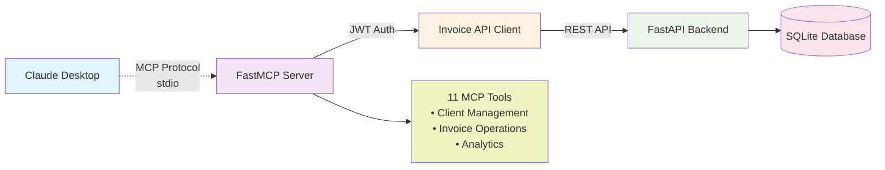

# Invoice Management Application

A modern, multi-tenant invoice management system built with FastAPI and React. This application allows businesses to manage clients, create invoices, track payments, and generate professional PDF invoices.

## 🚀 Features

### Core Functionality
- **Multi-tenant Architecture** - Isolated data per tenant/organization
- **Client Management** - Add, edit, and manage customer information
- **Invoice Creation** - Generate professional invoices with automatic numbering
- **Payment Tracking** - Record and track payments against invoices
- **Dashboard Analytics** - Overview of financial metrics and statistics
- **PDF Generation** - Export invoices as professional PDF documents
- **Email Delivery** - Send invoices directly to clients via email with PDF attachments
- **Responsive Design** - Modern UI that works on desktop and mobile

### Authentication & Security
- **User Authentication** - Secure login/signup with JWT tokens
- **Role-based Access** - Admin, user, and viewer roles
- **Google SSO** - Optional Google OAuth integration
- **Tenant Isolation** - Complete data separation between organizations

### Technical Features
- **RESTful API** - Clean, documented API endpoints
- **AI Integration (MCP)** - Model Context Protocol server for AI assistant integration
- **Email Service Integration** - Support for AWS SES, Azure Email Services, and Mailgun
- **Real-time Updates** - Instant UI updates with optimistic rendering
- **Search & Filtering** - Advanced filtering and search capabilities
- **Docker Support** - Containerized deployment ready
- **Database Migrations** - Automated schema management

## 🏗️ Architecture

### Backend (FastAPI)
- **Framework**: FastAPI with Python 3.11
- **Database**: SQLite with SQLAlchemy ORM
- **Authentication**: JWT with fastapi-users
- **Documentation**: Auto-generated OpenAPI/Swagger docs
- **Deployment**: Docker containerized

### Frontend (React)
- **Framework**: React 18 with TypeScript
- **Build Tool**: Vite
- **UI Library**: ShadCN UI components with Tailwind CSS
- **State Management**: TanStack Query for server state
- **Routing**: React Router with protected routes
- **Deployment**: Docker containerized

### Infrastructure
- **Orchestration**: Docker Compose
- **Database**: Persistent SQLite with volume mounting
- **Networking**: Internal Docker network for service communication

## 📧 Email Invoice Delivery

The application includes comprehensive email functionality to send invoices directly to clients with professional PDF attachments.

### 🌟 Email Features

- **Multiple Email Providers** - Support for AWS SES, Azure Email Services, and Mailgun
- **Professional Templates** - Beautiful HTML and text email templates
- **PDF Attachments** - Automatically attach invoice PDFs to emails
- **Configuration Management** - Easy setup through the settings interface
- **Test Functionality** - Test email configuration before going live
- **Error Handling** - Comprehensive error handling and logging

### 📊 Supported Email Providers

#### AWS SES (Simple Email Service)
- **Setup**: Configure AWS credentials and region
- **Features**: High deliverability, detailed analytics, cost-effective
- **Requirements**: AWS Access Key ID, Secret Access Key, and region

#### Azure Email Services
- **Setup**: Configure Azure Communication Services connection string
- **Features**: Enterprise-grade reliability, global scale
- **Requirements**: Azure Communication Services connection string

#### Mailgun
- **Setup**: Configure API key and domain
- **Features**: Developer-friendly API, detailed tracking
- **Requirements**: Mailgun API key and verified domain

### 🔧 Email Configuration

1. **Navigate to Settings** → **Email Settings** tab
2. **Enable Email Service** - Toggle the email functionality
3. **Select Provider** - Choose from AWS SES, Azure, or Mailgun
4. **Configure Credentials** - Enter your provider-specific settings
5. **Test Configuration** - Send a test email to verify setup
6. **Save Settings** - Store your configuration securely

### 📤 Sending Invoices

#### From Invoice Form
- Open any saved invoice
- Click the **Send Email** button in the preview section
- Email will be sent to the client's email address automatically

#### Via API
```bash
POST /api/email/send-invoice
{
  "invoice_id": 123,
  "include_pdf": true,
  "to_email": "client@example.com"  // Optional override
}
```

### 🎨 Email Templates

Professional email templates include:
- **Company branding** with logo and contact information
- **Invoice details** including number, date, amount, and status
- **Payment instructions** and due date information
- **Professional formatting** for both HTML and text versions

### 🛡️ Security & Best Practices

- **Secure Credential Storage** - All API keys are stored securely
- **Validation** - Email configuration is validated before saving
- **Error Handling** - Comprehensive error messages and logging
- **Rate Limiting** - Built-in protection against email abuse

## 🤖 AI Integration (MCP)

This application includes a **Model Context Protocol (MCP)** server that enables AI assistants (like Claude Desktop) to interact with your invoice system through natural language.

> 📖 **For complete MCP setup, configuration, and development documentation, see [api/MCP/README.md](api/MCP/README.md)**

### 🚀 Quick MCP Overview

The MCP server transforms your invoice system into an AI-accessible service, allowing natural language interactions like:
- *"Show me all clients with outstanding balances"*
- *"Create a new invoice for John Doe for $1,500"*
- *"Find all overdue invoices from last month"*

### 📊 MCP Architecture



### MCP Features
- **Client Management**: List, search, create, and retrieve client information
- **Invoice Operations**: Manage invoices with full CRUD operations
- **Advanced Search**: Intelligent search across clients and invoices
- **Analytics**: Get insights on outstanding balances and overdue invoices
- **Real-time Data**: Direct API integration for up-to-date information

### Available MCP Tools
- `list_clients` - List all clients with pagination
- `search_clients` - Search clients by name, email, phone, or address
- `get_client` - Get detailed client information by ID
- `create_client` - Create new clients
- `list_invoices` - List all invoices with pagination
- `search_invoices` - Search invoices by various fields
- `get_invoice` - Get detailed invoice information by ID
- `create_invoice` - Create new invoices
- `get_clients_with_outstanding_balance` - Find clients with unpaid invoices
- `get_overdue_invoices` - Get invoices past their due date
- `get_invoice_stats` - Get overall invoice statistics

### 🔧 Quick Setup

#### 1. Configure Environment
```bash
cd api/MCP
cp example.env .env
# Edit .env with your credentials
```

#### 2. Start MCP Server
```bash
python -m MCP --email your_email@example.com --password your_password
```

#### 3. Configure Claude Desktop
Add to your `claude_desktop_config.json`:
```json
{
  "mcpServers": {
    "invoice-app": {
      "command": "/path/to/your/venv/bin/python",
      "args": ["/path/to/your/project/api/launch_mcp.py", "--email", "your_email", "--password", "your_password"],
      "env": {
        "INVOICE_API_BASE_URL": "http://localhost:8000/api"
      }
    }
  }
}
```

### 📚 Detailed Documentation

For comprehensive setup instructions, configuration options, troubleshooting, and development guides:

**👉 [Complete MCP Documentation →](api/MCP/README.md)**

The MCP documentation includes:
- 📊 Architecture diagrams and visual guides
- 🛠️ Detailed installation and configuration
- 📋 Environment variable reference
- 🔒 Security best practices
- 🧪 Testing and development setup
- 🎯 Claude Desktop integration examples
- 📸 Screenshots and example conversations
- 🖼️ **Live screenshots** showing MCP tools in action:
  - Creating invoice clients through natural language
  - Listing and searching clients
  - Managing invoices with AI assistance
  - Real Claude Desktop integration examples

## 📋 Prerequisites

- Docker and Docker Compose
- Node.js 18+ (for local development)
- Python 3.11+ (for local development)

## 🚀 Quick Start

### Using Docker (Recommended)

1. **Clone the repository**
   ```bash
   git clone <repository-url>
   cd invoice-app
   ```

2. **Start the application**
   ```bash
   docker-compose up -d
   ```

3. **Access the application**
   - Frontend: http://localhost:8080
   - Backend API: http://localhost:8000
   - API Documentation: http://localhost:8000/docs

### Local Development Setup

#### Backend Setup
```bash
cd api
python -m venv venv
source venv/bin/activate  # On Windows: venv\Scripts\activate
pip install -r requirements.txt
python db_init.py  # Initialize database
uvicorn main:app --reload
```

#### Frontend Setup
```bash
cd ui
npm install
npm run dev
```

## 📚 API Documentation

The API is fully documented and available at:
- **Swagger UI**: http://localhost:8000/docs
- **ReDoc**: http://localhost:8000/redoc

### Key Endpoints

#### Authentication
- `POST /api/auth/register` - User registration
- `POST /api/auth/login` - User login
- `POST /api/auth/logout` - User logout

#### Clients
- `GET /api/clients/` - List clients
- `POST /api/clients/` - Create client
- `PUT /api/clients/{id}` - Update client
- `DELETE /api/clients/{id}` - Delete client

#### Invoices
- `GET /api/invoices/` - List invoices
- `POST /api/invoices/` - Create invoice
- `PUT /api/invoices/{id}` - Update invoice
- `DELETE /api/invoices/{id}` - Delete invoice

#### Payments
- `GET /api/payments/` - List payments
- `POST /api/payments/` - Record payment
- `PUT /api/payments/{id}` - Update payment

## 🗃️ Database Schema

### Core Entities

#### Tenants
- Multi-tenant isolation
- Company information (name, address, tax ID)
- Logo and branding settings

#### Users
- Authentication and authorization
- Role-based access control
- Google SSO integration

#### Clients
- Customer information
- Contact details
- Balance tracking

#### Invoices
- Auto-generated invoice numbers
- Due dates and status tracking
- Notes and custom fields

#### Payments
- Payment tracking against invoices
- Multiple payment methods
- Reference numbers

## 🎨 Frontend Structure

```
ui/src/
├── components/          # Reusable UI components
│   ├── ui/             # ShadCN UI components
│   ├── auth/           # Authentication components
│   ├── invoices/       # Invoice-specific components
│   └── layout/         # Layout components
├── pages/              # Route components
├── lib/                # Utilities and API client
├── hooks/              # Custom React hooks
└── routers/            # Route definitions
```

## 🔧 Configuration

### Environment Variables

#### Backend (.env)
```env
DATABASE_URL=sqlite:///./invoice_app.db
SECRET_KEY=your-secret-key-here
JWT_SECRET_KEY=your-jwt-secret
GOOGLE_CLIENT_ID=your-google-client-id
GOOGLE_CLIENT_SECRET=your-google-client-secret
```

#### Frontend (.env)
```env
VITE_API_URL=http://localhost:8000/api
```

## 🚀 Deployment

### Production Deployment

1. **Update environment variables** for production
2. **Build and deploy with Docker Compose**:
   ```bash
   docker-compose -f docker-compose.prod.yml up -d
   ```

### Cloud Deployment
- **Backend**: Deploy to any platform supporting Docker (AWS ECS, Google Cloud Run, etc.)
- **Frontend**: Deploy to static hosting (Vercel, Netlify, AWS S3 + CloudFront)
- **Database**: Migrate to PostgreSQL for production use

## 🔒 Security Considerations

- JWT tokens for authentication
- Password hashing with bcrypt
- CORS properly configured
- SQL injection protection via SQLAlchemy ORM
- Input validation with Pydantic schemas
- Tenant isolation at database level

## 🧪 Testing

### Backend Tests
```bash
cd api
pytest
```

### Frontend Tests
```bash
cd ui
npm test
```

## 📈 Performance

- **Database**: Optimized queries with proper indexing
- **Caching**: Query result caching with TanStack Query
- **Lazy Loading**: Component-level code splitting
- **Compression**: Gzip compression for API responses

## 🤝 Contributing

1. Fork the repository
2. Create a feature branch: `git checkout -b feature/new-feature`
3. Commit changes: `git commit -am 'Add new feature'`
4. Push to branch: `git push origin feature/new-feature`
5. Submit a pull request

## 📄 License

This project is licensed under the MIT License - see the LICENSE file for details.

## 🔮 Roadmap

- [x] **AI Integration (MCP)** - Model Context Protocol server for AI assistants ✨
- [x] **Email Invoice Delivery** - Support for AWS SES, Azure Email Services, and Mailgun ✨
- [ ] Recurring invoices
- [ ] Multi-currency support
- [ ] Advanced reporting and analytics  
- [ ] Mobile app (React Native)
- [ ] Integration with payment gateways
- [ ] Automated backup system
- [ ] Advanced user permissions

## 🆘 Support

For support and questions:
- Create an issue on GitHub
- Check the documentation at `/docs`
- Review API documentation at `/docs` endpoint

## 🏷️ Version History

- **v1.0.0** - Initial release with core functionality
  - Multi-tenant architecture
  - Invoice and client management
  - Payment tracking
  - PDF generation
  - Modern React UI
